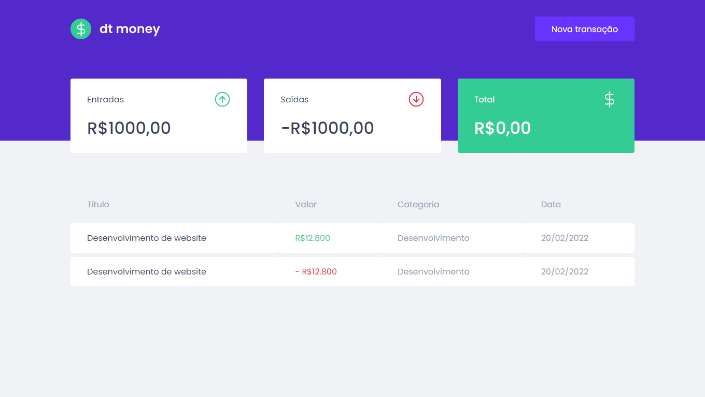
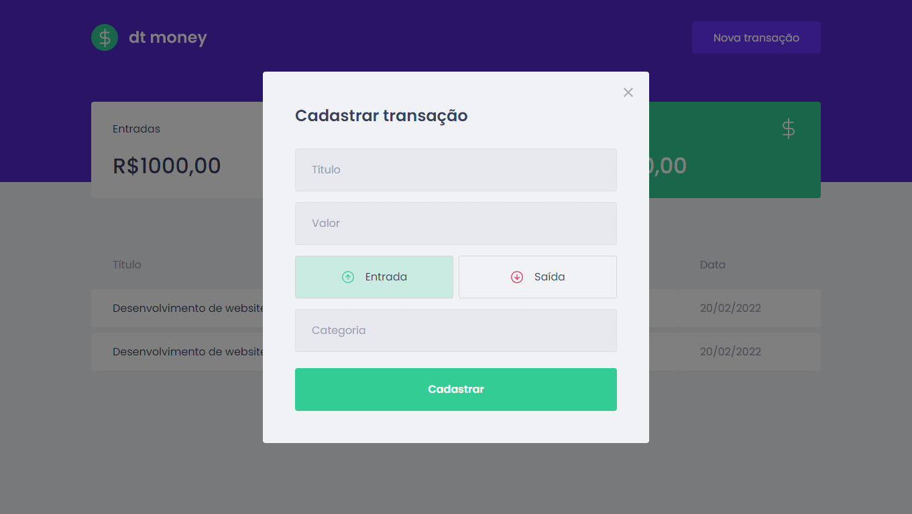

<p align="center">
  
  <h2 align="center">dtmoney - site em desenvolvimento com ReactJS</h2>
  <p align="center">Sistema que possibilita ao usuário cadastrar seus gastos e ganhos financeiros<p>
  
  <p align="center">
    <a href="https://www.instagram.com/luis_gustta13/">
    	
    </a>
    <a href="https://www.linkedin.com/in/luis-gusta-oliveira/">
    	
    </a>
    <a href="https://web.dio.me/users/LGustta13">
    	
    </a>
  </p>
</p>

<p align="center">
	<sub>
		<i>A documentação a seguir será postada em Inglês em breve!</i>
	</sub>
</p>

<br>

## Sumário

- [FUNCIONAMENTO DA APLICAÇÃO](#Funcionamento)
- [INICIALIZANDO O PROJETO PELO REACT](#Inicio)
- [O QUE SABER ANTES DE COMEÇAR?](#Saber)
- [ESTRUTURA DE PASTAS DO PROJETO](#Estrutura)
- [TYPESCRIPT](#Type)

<br>

<div id='Funcionamento'/>
	
## Funcionamento da aplicação
	
<p align="center">
  
  
</p>

<br>

A ideia do site é entregar uma possibilidade ao usuário de organizar seus gastos, sendo possível inserir ganhos e também as despesas. Por fim será calculado a receita final para o mesmo, sendo seu valor sempre atualizado dependendo das informações que são inseridas no modal de nova transação, conforme imagem. Por enquanto é possível inserir cards e deletar, porém novas features já estão a caminho!

<br>

<div id='Inicio'/>

## Inicializando o projeto pelo React

O React é uma biblioteca baseada em JavaScript que facilita o desenvolvimento de interfaces para aplicações web e dispositivos móveis, de forma escalonável (dividido em etapas e níveis), onde a renderização do código é mais rápida, leve e menor, uma vez que o .jsx (JS e XML) realiza esse procedimento.
Em relação ao ReactJS, a tecnologia possibilita construir interfaces de usuário. Pode ser localizada no seguinte [repositório](https://github.com/facebook/react/) e  na sua [documentação](https://pt-br.reactjs.org/docs/getting-started.html) oficial.

Seguindo as recomendações de preparação do ambiente de desenvolvimento, é interessante instalar ou atualizar: 
- Chocolatey (para instalação de ferramentas e dependências no Windows)
```
choco upgrade chocolatey
```

- NPM (gerenciador de pacotes do Node.js)
```
npm install -g npm
```

- Yarn (instalação de pacotes e dependências de códigos prontos para uso)
```
choco upgrade yarn
```

- Node.js (ambiente de execução Javascript server-side)
```
Instalar o .exe no site https://nodejs.org/en/
```

<br>

<div id='Saber'/>

## O que saber antes de começar?

Criando um novo projeto React pelo CLI
```
yarn create-react-app <nome_do_projeto>
```


Para executar a aplicação no servidor local pelo react-scripts

	yarn start   

Caso este projeta seja clonado, executar para baixar todas as dependências

    yarn

<br>

<div id='Estrutura'/>

## Estrutura de pastas do projeto

- **images**: pasta que contém as imagens utilizadas no README
- **public**: contém arquivos estáticos que não são processados pelo webpack
- **src**: contém todos os componentes e arquivos de estilização da aplicação
- **assets**: contém as fontes e imagens do projeto
- **components**: onde estão todos os componentes da aplicação
- **services**: lida com configurações necessárias para consumo de API's
- **styles**: lida com os estilos globais da aplicação
- **App.tsx**: arquivo principal com os componentes em JSX que rodarão na aplicação.
- **package.json**:  arquivo criado pelo NPM com configurações relacionadas às dependências de desenvolvimento, de produção e scripts de inicialização.
- **tsconfig.json**: configurações do Typescript

<br>

<div id='Type'/>

## Typescript

O [TypeScript](https://www.typescriptlang.org/docs/handbook/intro.html) é um superset de tipagem para o JavaScript, podendo ser usado em componentes e objetos. Não é muito intuitivo mas em grandes proporções é um facilitador para não se perder no projeto por conta de tipagem.

Configurando o TypeScript em um projeto React do zero

	yarn create-react-app <nome> --template typescript 
	
Configurando o TypeScript em um projeto React Native em andamento

	yarn add typescript @types/react -D

Para o segundo caso, deve-se criar o seguinte arquivo de configuração `tsconfig.json`

<br>
